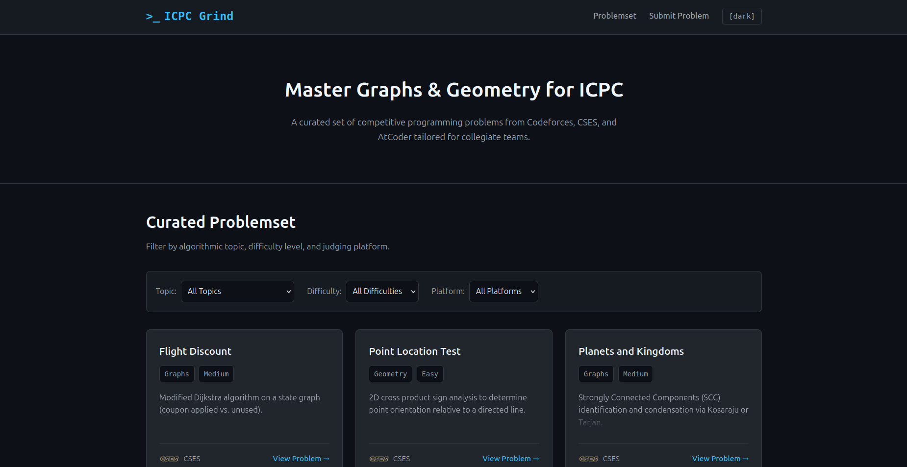
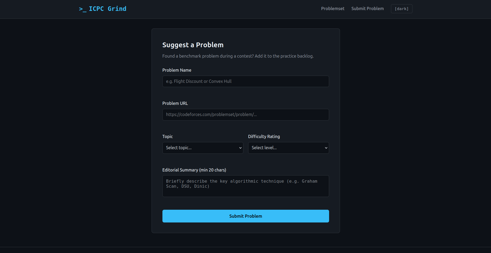
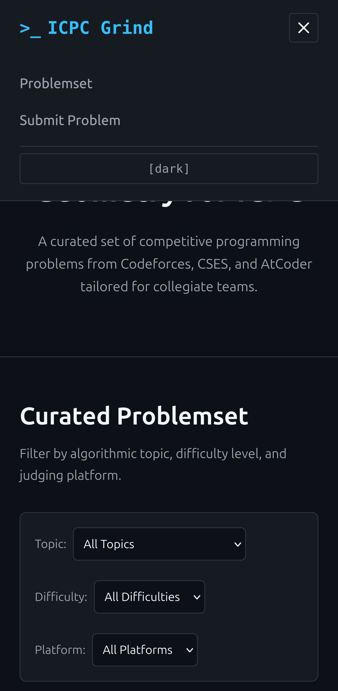
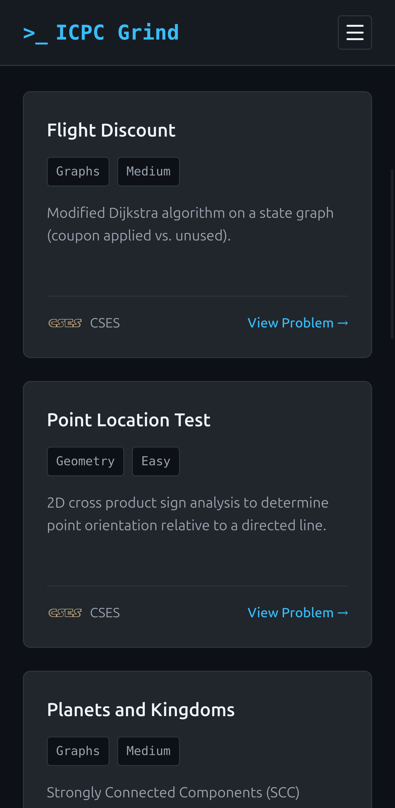
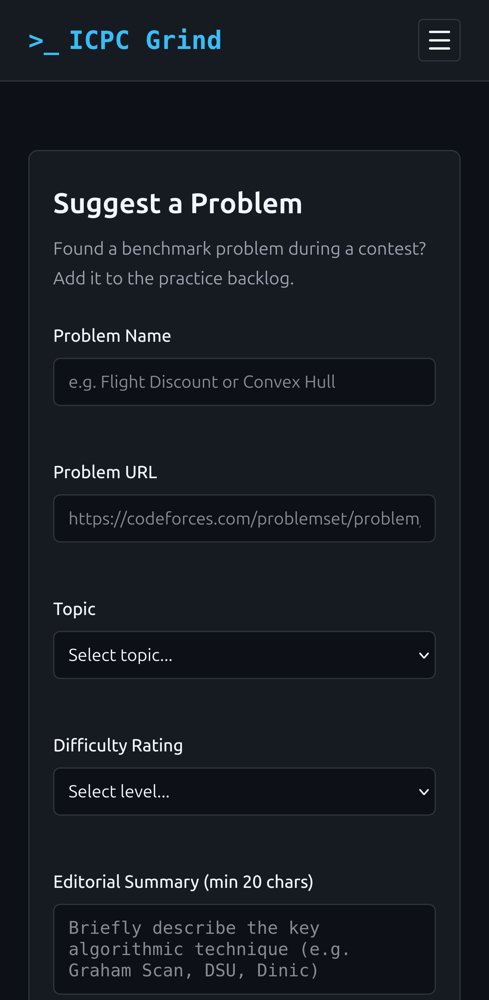

# ICPC Grind — Competitive Programming Hub

Plataforma web accesible, reactiva y responsiva desarrollada para centralizar y clasificar problemas algorítmicos de diferentes jueces en línea (Codeforces, CSES, AtCoder), pensada específicamente para el entrenamiento de equipos colegiados de ICPC.

* **Deploy en producción:** [https://csesgrind.vercel.app/](https://csesgrind.vercel.app/)

---

### Descripción del proyecto

ICPC Grind nace como una solución para equipos colegiados que necesitan un entrenamiento curado y enfocado en tópicos clave (como grafos y geometría computacional). En lugar de montar evaluadores y sandboxes aislados desde cero para compilar y ejecutar código, el proyecto funciona como un agregador inteligente: recopila problemas de calidad, detecta automáticamente la plataforma de origen mediante la URL, permite filtrar de inmediato por dificultad o tema, y ofrece un canal para que la comunidad sugiera nuevos problemas para revisión. Todo el contenido se redactó en inglés porque es el estándar global en programación competitiva y el formato oficial en el que se presentan los certámenes de ICPC.

---

### Capturas de pantalla

#### Vista Escritorio

* **Catálogo curado, filtros y encabezado:**
  

* **Formulario de sugerencia de problemas:**
  

#### Vista Móvil

* **Menú hamburguesa desplegado con selector de tema integrado:**
  

* **Catálogo adaptado a una sola columna:**
  

* **Formulario responsivo con campos apilados verticalmente:**
  

---

### Decisiones técnicas

**Arquitectura y maquetación (Flexbox vs. CSS Grid)**

* **CSS Grid (`.problems-grid`):** Se utilizó Grid bidimensional exclusivamente para el catálogo principal. Esto asegura una distribución regular por columnas (1 columna en móviles, 2 en tablets y 3 en escritorios) manteniendo una alineación perfecta entre tarjetas sin importar el contenido.

* **Flexbox:** Se implementó en componentes unidireccionales como la barra de navegación pegajosa, el contenedor de filtros (`flex-wrap: wrap`) y dentro de cada tarjeta (`.card`). En las tarjetas, `display: flex; flex-direction: column; justify-content: space-between; height: 100%` garantiza que el pie de página (`.card-footer`) quede clavado al fondo y todas las cards compartan la misma altura en la fila.

* **Navegación pegajosa:** El `header` utiliza `position: sticky; top: 0` para acompañar el desplazamiento de la página sin obligar al usuario a subir manualmente para filtrar o alternar el tema visual.

**Lógica y ciclo de vida de la aplicación (TypeScript / JS)**

* **Tipado estricto y modularidad:** A pesar de que la pauta inicial planteaba JavaScript estándar, decidí trabajar con TypeScript bajo la carpeta `src/` modularizado en `types.ts`, `data.ts` y `main.ts`. Esto me permitió contar con interfaces claras (`Problem`, `Topic`, `Difficulty`) y evitar errores de tipado en tiempo de ejecución.

* **Detección automática de plataforma:** La función `detectSource()` analiza la estructura del enlace ingresado para catalogar si proviene de Codeforces, CSES, AtCoder o Community, inyectando de forma dinámica el ícono oficial correspondiente.

* **Filtrado dinámico:** Al cambiar los selectores de tema, dificultad o plataforma, la interfaz actualiza la vista en memoria sin recargar el navegador. Si ningún ejercicio coincide, muestra un mensaje accesible mediante la clase `.empty-catalog`.

* **Formulario y simulación de backend:** El formulario cuenta con validación manual estricta (campos obligatorios, longitud mínima de 20 caracteres y URLs con protocolo válido). Los errores se renderizan en línea debajo de cada campo con elementos `` asociados para evitar el uso intrusivo de `alert()`. Al enviar, se deshabilita temporalmente el botón para mitigar dobles envíos y se renderiza el problema inmediatamente al inicio de la lista local.

* **Gestión de tema (Modo Oscuro / Claro):** Sigue un orden de prioridades claro: preferencia manual en `localStorage` > preferencia del sistema (`prefers-color-scheme`) > modo oscuro por defecto.

**Accesibilidad (A11y)**

* Navegación por teclado fluida con anillos de enfoque (`:focus-visible`) explícitos en botones, enlaces e inputs.

* Contraste de texto ajustado en tema claro (`#4b5563`).

* Íconos de plataforma con etiquetas `alt` reales y descriptivas (ej. `"CSES problem set official wooden logo"`, `"Codeforces online judge icon"`) en lugar de atributos vacíos.

* Formularios y contenedores accesibles con atributos ARIA estructurados (`aria-describedby`, `aria-required="true"`, `aria-live="polite"`, `role="region"`).

---

### Retos y lo más difícil del desarrollo

* **Manejo del ciclo de vida del DOM y parpadeos (`.preload`):**
Lo más retador no fue programar la lógica del modo oscuro, sino toparme con el molesto flasheo de transición al recargar la página. Al no haber usado antes patrones como la clase temporal `.preload` en el `body`, el problema era de puro desconocimiento sobre cómo el navegador dispara las transiciones CSS antes de que el script termine de aplicar las variables del tema. Entender que debía apagar todas las transiciones con `transition: none !important` durante el primer frame y remover la clase justo después de leer el `localStorage` fue una curva de aprendizaje interesante para lograr que la interfaz cargara limpia.

* **Estandarización de alturas y el desvanecimiento de texto (*fade-out*):**
Mantener la simetría de la cuadrícula con descripciones de longitud variable fue otro reto complejo. Si se usaba `-webkit-line-clamp`, el texto se cortaba de golpe como si estuviera roto; y si se ponía un gradiente tradicional encima con `::after`, se tapaban renglones en textos que apenas ocupaban una o dos líneas. La dificultad estuvo en dar con una solución limpia que no dependiera de trucos frágiles ni llenara el código de condicionales en JavaScript, resolviéndolo finalmente con una máscara alfa (`mask-image`) para que el desvanecimiento fuera puramente visual y respetara la estética de las tarjetas.

* **Ajuste y proporción de recursos locales:**
Alinear íconos con relaciones de aspecto dispares (como el logo horizontal de CSES frente a los formatos cuadrados de Codeforces o AtCoder) requirió balancear propiedades como `object-fit: contain` y `max-width` para que el pie de la tarjeta no se descuadrara al redimensionar la ventana o navegar con teclado.

---

### Bitácora cronológica de desarrollo

*Para documentar las decisiones sobre la marcha y no dejar todo para el final, fui registrando cada elección técnica y su motivo a modo de bitácora. Todo el desarrollo, la lógica y la arquitectura fueron implementados por mí mismo, manteniendo mis notas con mi propia voz a lo largo del proceso para reflejar la evolución real del proyecto y dejar constancia de mi autoría en cada decisión. Al concluir el desarrollo me apoyé en IA únicamente para pulir la redacción final de este documento de forma fluida y clara.*

* **Inicio y configuración inicial:** Decisión de usar TypeScript en lugar de JavaScript estándar por seguridad de tipos y mantenimiento. Configuración de tokens de diseño en `:root` para centralizar paletas de color y soporte inicial de temas claro/oscuro.

* **Modularización:** División del proyecto bajo `src/` (`types.ts`, `data.ts`, `main.ts`). Creación del set inicial con problemas reales de grafos y geometría de CSES.

* **Maquetación responsiva:** Estructuración de la cuadrícula de problemas con CSS Grid y montaje del `header` pegajoso con Flexbox.

* **Validación y UX en formulario:** Reemplazo de alertas nativas por mensajes de error en línea (`.error-msg`) bajo cada input. Desactivación temporal del botón de envío para mitigar dobles clicks accidentales.

* **Modo oscuro sin saltos de transición:** Implementación de persistencia con `localStorage`, escucha de eventos del sistema y eliminación del destello de carga con la clase `.preload`.

* **Detección de plataformas:** Creación del analizador de URLs para extraer el dominio y clasificar automáticamente si el problema pertenece a Codeforces, CSES, AtCoder o Community.

* **Accesibilidad e integración visual:** Limpieza de errores en el validador semántico, adición de estados `:focus-visible`, aumento de contraste en tipografía y vinculación de íconos locales con textos alternativos (`alt`) específicos.

* **Estandarización de tarjetas:** Implementación de `mask-image` para desvanecer suavemente descripciones extensas y fijar la cuadrícula a alturas simétricas.

---

### Uso de Inteligencia Artificial

* **Uso de IA:** Todo el desarrollo, estructuración del código y elecciones técnicas fueron ejecutados por mí a lo largo del proceso. Me apoyé en herramientas de IA de forma puntual como asistente de depuración para diagnosticar errores específicos (como advertencias del validador de accesibilidad y detalles del ciclo de renderizado en CSS) y, al concluir la implementación, para organizar los encabezados y pulir la redacción final de esta documentación de manera clara y profesional[cite: 7].